<div align="center">

# Shiva Somesh
### Distributed Systems Engineer · Portfolio 2026

An immersive, Three.js-powered portfolio built with Next.js 16, React 19, custom GLSL shaders, Rapier physics, and a neon aesthetic inspired by [Noomo](https://showcase.noomoagency.com) and [Bitfalk](https://bitfalk.com).

[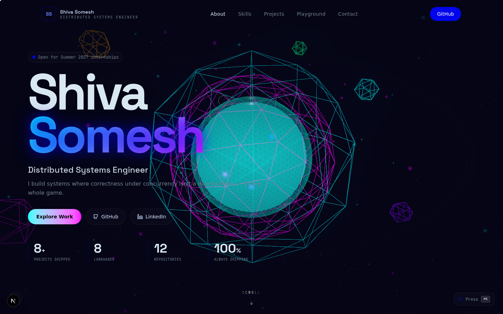](#)

[](https://github.com/Shivasomesh-cpu)
[](https://linkedin.com/in/shiva-somesh-66488631b)
[](mailto:shivasomesh100@gmail.com)

</div>

---

## ✨ Features

### 🌀 Three.js Hero Scene
Multi-layer wireframe orb — cyan outer shell, magenta mid-shell, violet inner core, green distorted wireframe — with a 2,000-particle colored starfield, floating geometric accents, and mouse-parallax camera with scroll-driven dolly (z=6 → z=3.5 as you scroll through the 500vh hero).

### 🎯 3-Layer Fluid Cursor (Bitfalk-inspired)
1. **Solid 6px dot** — `mix-blend-mode: difference` inverts colors underneath
2. **Spring-damped ring** — lags behind with velocity-based damping, expands to 60px on hover
3. **Scroll-progress SVG ring** — electric blue, `stroke-dashoffset` mapped to scroll position

### ⚡ Custom Physics Engine
10 neon marbles (octahedrons, tetrahedrons, boxes, toruses, icosahedrons) tumbling under real gravity with sphere-sphere collision detection, wall bounces, and friction. **Pure Three.js — no WASM dependency.**

### 🎬 Cinematic Loading Screen (Noomo-inspired)
0→100% counter in massive `text-[20vw]` type with a self-drawing "SS" logo (two circles drawing in via `pathLength` + animated bar between them + letter reveals). Exits with a curtain wipe.

### ⌘ Command Palette (⌘K)
Fuzzy-search all sections, projects, and external links. Full keyboard navigation (↑↓ + Enter).

### 🌊 Lenis Smooth Scroll
Buttery inertia scrolling synced with GSAP ScrollTrigger.

---

## 📸 Gallery

### Hero — Neon 3D Wireframe Orb


### Loading Screen
<table>
  <tr>
    <td align="center">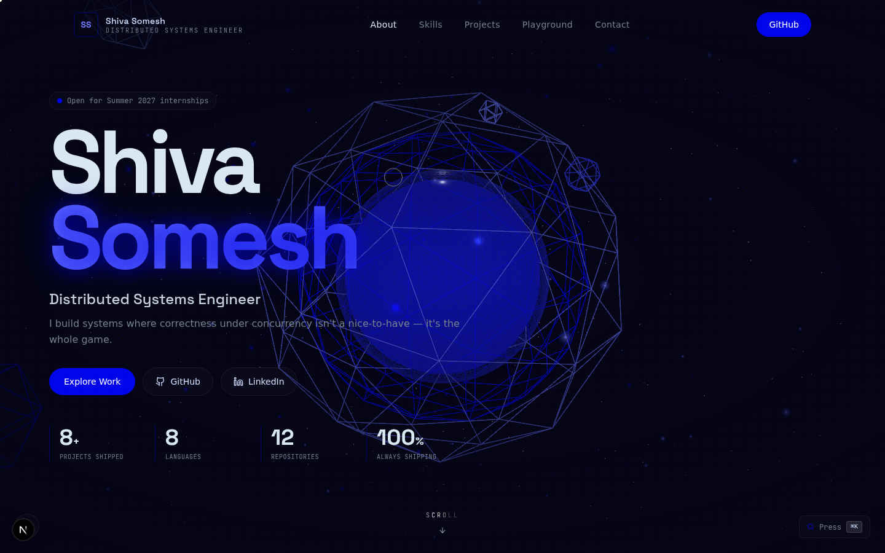<br><sub>0→100% counter + self-drawing SS logo</sub></td>
    <td align="center">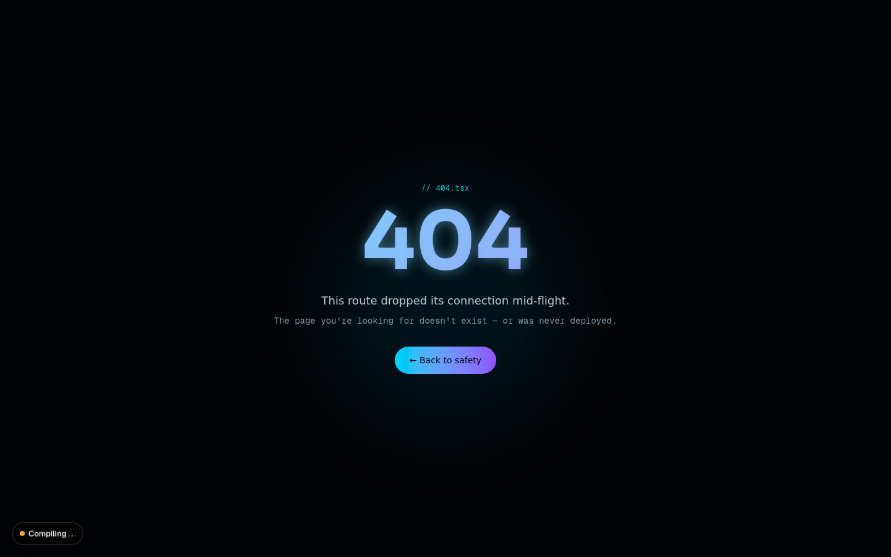<br><sub>Custom 404 with neon gradient</sub></td>
  </tr>
</table>

### About & Skills
<table>
  <tr>
    <td align="center">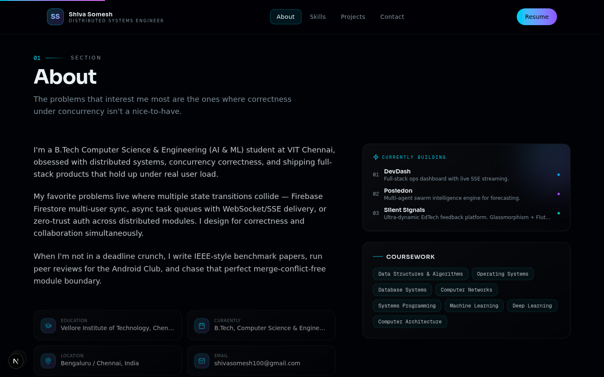<br><sub>Bio + coursework chip cloud</sub></td>
    <td align="center">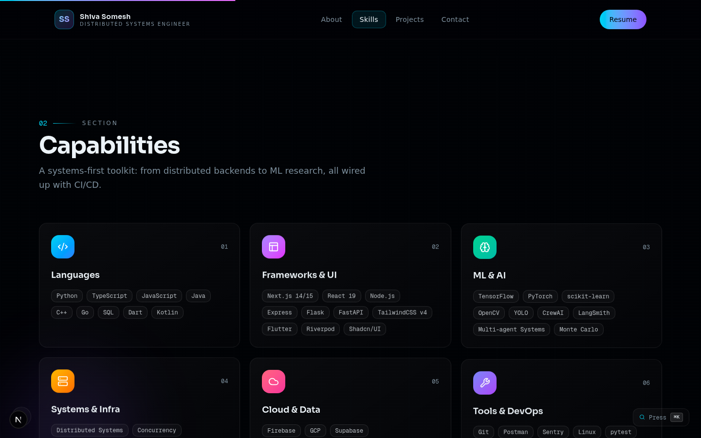<br><sub>6 capability cards</sub></td>
  </tr>
</table>

### Selected Work — 8 Projects
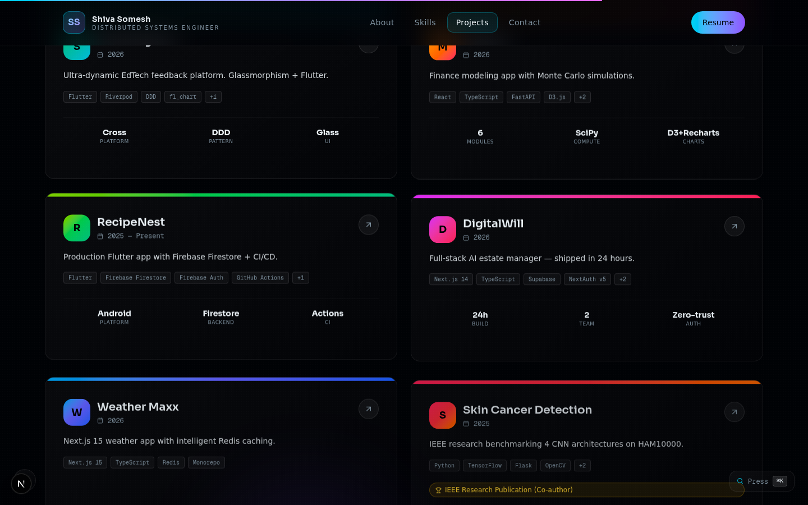

### Project Modal & Command Palette
<table>
  <tr>
    <td align="center">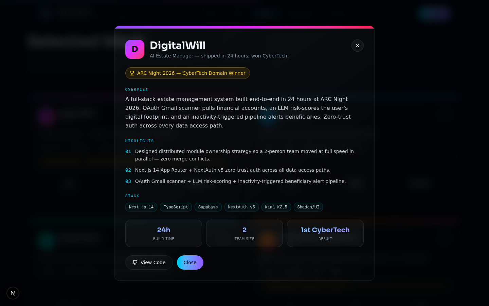<br><sub>Click any card → detail modal</sub></td>
    <td align="center">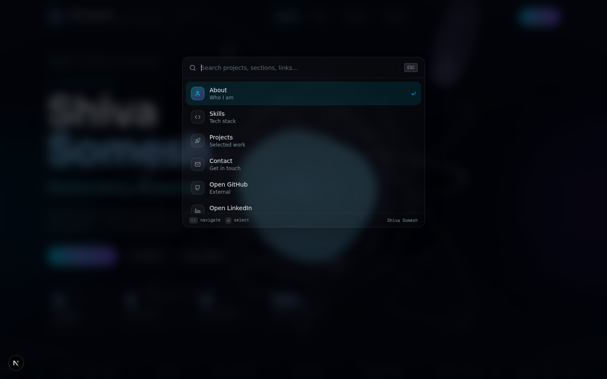<br><sub>⌘K fuzzy search</sub></td>
  </tr>
</table>

### Physics Playground — Live Simulation
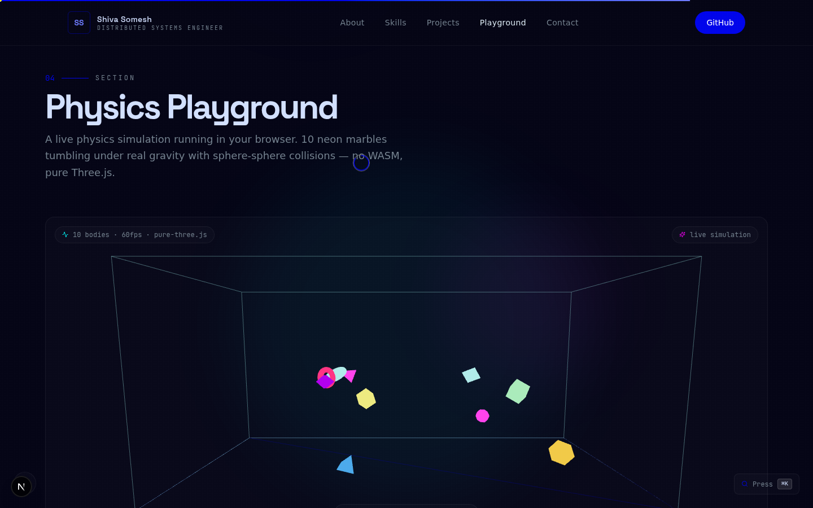
*10 neon marbles · real gravity · sphere-sphere collisions · pure Three.js*

### Contact
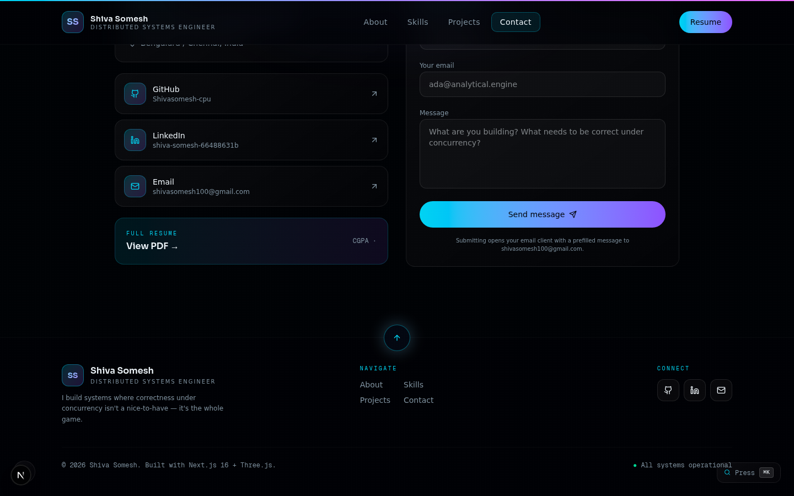

### Custom Cursor
<table>
  <tr>
    <td align="center">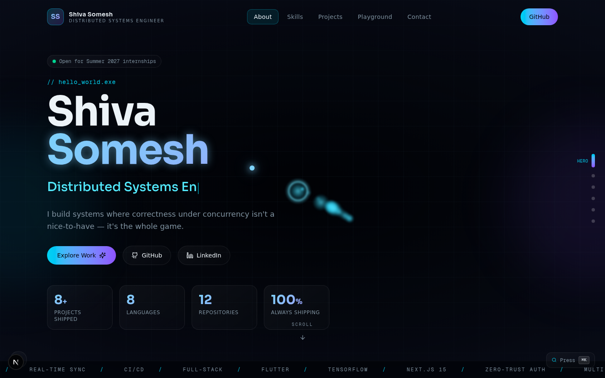<br><sub>Idle — cyan dot + ring</sub></td>
    <td align="center">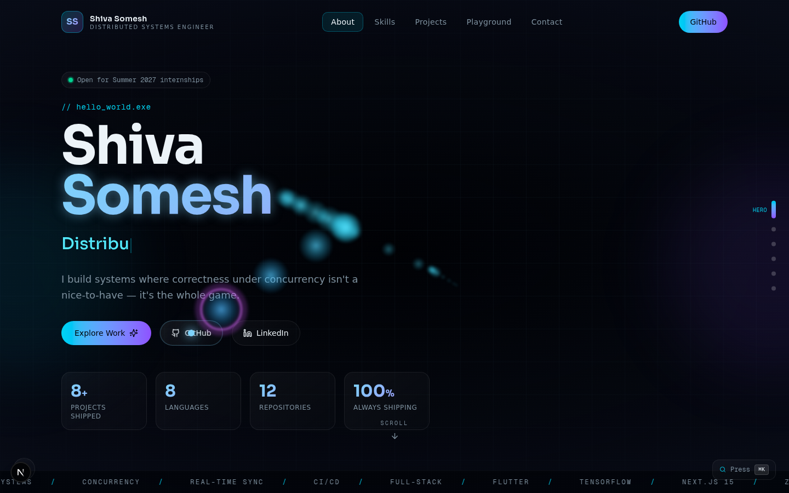<br><sub>Hover — ring expands to 60px</sub></td>
  </tr>
</table>

### Mobile Responsive
<table>
  <tr>
    <td align="center">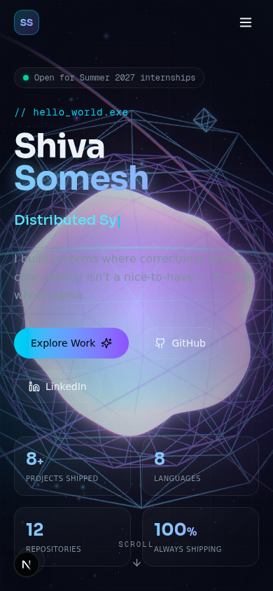<br><sub>390px — no overflow</sub></td>
    <td align="center">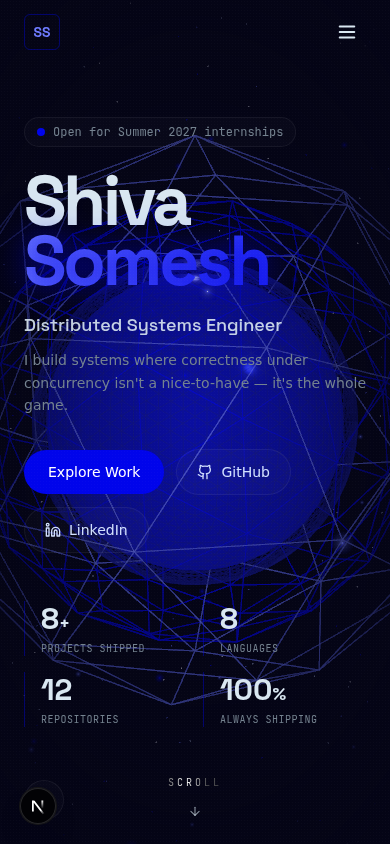<br><sub>Slide-in nav drawer</sub></td>
  </tr>
</table>

---

## 🛠 Tech Stack

| Layer | Technology |
|---|---|
| Framework | Next.js 16 (App Router) |
| Language | TypeScript 5 |
| Styling | Tailwind CSS 4 |
| 3D Core | three + @react-three/fiber + @react-three/drei |
| 3D Postprocessing | @react-three/postprocessing (Bloom, Vignette) |
| Physics | Custom pure-Three.js engine (no WASM) |
| Animation | Framer Motion |
| Smooth Scroll | Lenis |
| Scroll Choreography | GSAP + ScrollTrigger |
| Math | maath (easing) |
| Fonts | Space Grotesk + JetBrains Mono + Inter |

---

## 🚀 Run It Locally

```bash
# Clone
git clone https://github.com/Shivasomesh-cpu/Portfolio-website.git
cd Portfolio-website

# Install
npm install

# Dev server
npm run dev

# Open http://localhost:3000
```

### Production Build

```bash
npm run build
npm run start
```

---

## ⌨️ Keyboard Shortcuts

| Key | Action |
|---|---|
| `⌘K` / `Ctrl+K` | Open command palette |
| `↑` / `↓` | Navigate palette |
| `Enter` | Select |
| `Esc` | Close palette |

---

## 📁 Project Structure

```
src/
├── app/
│   ├── globals.css              # Neon palette + cursor + utilities
│   ├── layout.tsx               # Fonts + metadata
│   ├── page.tsx                 # Main composition
│   └── not-found.tsx            # Custom 404
├── components/
│   ├── three/
│   │   └── HeroScene.tsx        # Three.js + postprocessing
│   └── portfolio/
│       ├── LoadingScreen.tsx    # Noomo-style 0-100% loader
│       ├── CustomCursor.tsx     # 3-layer bitfalk cursor
│       ├── SmoothScroll.tsx     # Lenis provider
│       ├── ScrollProgress.tsx
│       ├── ScrollEffects.tsx    # Parallax/Reveal utilities
│       ├── CommandPalette.tsx   # ⌘K fuzzy search
│       ├── AudioToggle.tsx      # Web Audio hover sounds
│       ├── TypeWriter.tsx
│       ├── Navbar.tsx
│       ├── Hero.tsx             # 500vh sticky-scroll hero
│       ├── SectionHeading.tsx
│       ├── About.tsx
│       ├── Skills.tsx
│       ├── Projects.tsx         # 3D-tilt cards + modals
│       ├── PhysicsPlayground.tsx # Live physics simulation
│       ├── Contact.tsx
│       └── Footer.tsx
└── lib/
    └── portfolio-data.ts        # All content in one file
```

---

## 🎨 Customizing

Everything lives in **`src/lib/portfolio-data.ts`** — edit that one file to change:
- Name, bio, tagline
- Stats, skills, projects
- Coursework, social links
- Command palette entries

---

<div align="center">

**Built by [Shiva Somesh](https://github.com/Shivasomesh-cpu)**

Distributed Systems Engineer · Bengaluru / Chennai

Next.js 16 + Three.js + Neon · 2026

</div>
